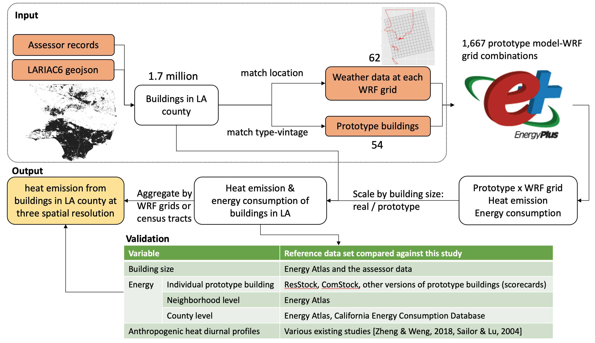
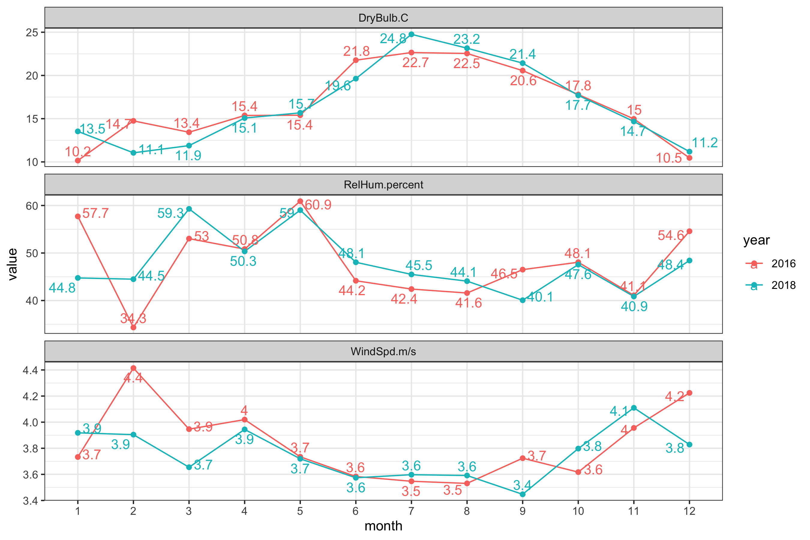
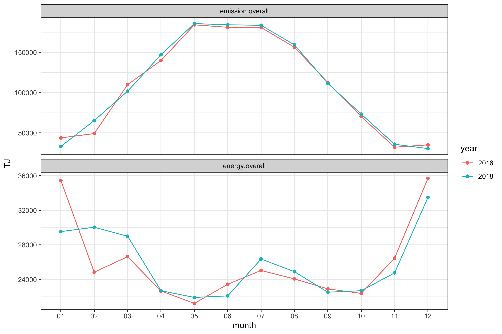
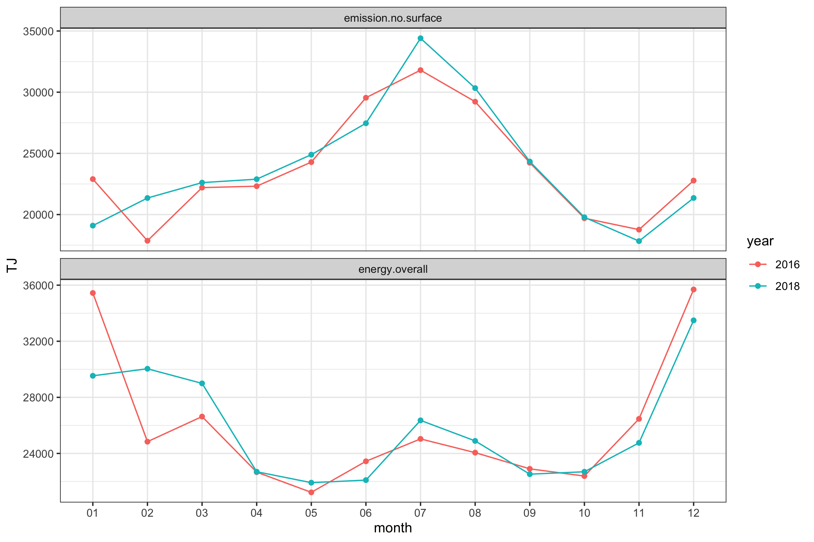

# xu_etal_2022_tbd

**LA County Building Anthropogenic Heat During Heat Waves**

Yujie Xu1, Pouya Vahmani1, Tianzhen Hong\*, Andy Jones1

1  LBNL

\* corresponding author:  thong@lbl.gov

## Abstract
Anthropogenic heat (AH) from buildings can increase urban temperature and
contribute to the urban heat island effect. The increased urban temperature
leads to more cooling demands in buildings during summer thus more
air-conditioning energy use and higher associated waste heat to the urban
environment, forming a positive feedback loop. This paper presents a dataset of
AH from buildings in Los Angeles (LA) County. The dataset is created with the
physics-based EnergyPlus building energy models to calculate individual
buildings’ AH considering WRF-UCM simulated microclimate conditions. The dataset
contains 8760 hourly AH in 2018 from buildings aggregated at three spatial
resolutions of 450m x 450m grid, 12km x 12km grid, and census tract for the
entire LA County. The AH is broken down into three components: building envelope
surface convection, heating, ventilation and air conditioning (HVAC) system heat
release, and zone exfiltration and exhaust air heat loss. The high-resolution AH
dataset can be used for research on building AH and its interaction with urban
microclimate, as well as informing effective AH reduction policy interventions
across LA County.

## Journal reference
TBD

## Code reference
<!-- References for each minted software release for all code involved.   -->

The following code files are adapted from the repository [im3-wrf](https://github.com/LBNL-ETA/im3-wrf/)

0_mv_inputs.py, 2_wrf_to_epw.py, 3_write_baseline_idf.py

<!-- These are generated by Zenodo automatically when conducting a release when Zenodo has been linked to your GitHub repository. The Zenodo references are built by setting the author order in order of contribution to the code using the author's GitHub user name.  This citation can, and likely should, be edited without altering the DOI. -->

<!-- If you have modified a codebase that is outside of a formal release, and the modifications are not planned on being merged back into a version, fork the parent repository and add a `.<shortname>` to the version number of the parent and construct your own name.  For example, `v1.2.5.hydro`. -->

<!-- Human, I.M. (2021, April 14). Project/repo:v0.1.0 (Version v0.1.0). Zenodo. http://doi.org/some-doi-number/zenodo.7777777 -->

## Data reference

The data set is held in MSDLive https://doi.org/10.57931/1892041

### Input data
Held in the input_data folder, including the external data files referenced downstream in the analysis. The data sources are shown in the following table

| input data | source |
|-------------|-------------------|
| Assessor_Parcels_Data_-_2019.csv                                           | [link] (https://data.lacounty.gov/search?categories=open%20data)                                                              |
| LARIAC6_LA_County.geojson                                                  | [link] (https://lariac-lacounty.hub.arcgis.com/)                                                                              |
| WRF data in annual_WRF and M02_EnergyPlus_Forcing_Historical_LowRes folder | Generated from The Weather Research and Forecasting (WRF) model (version 4.2.1)                                              |
| high-resolution 450m x 450 grid latitude longitude                         | generated from WRF model                                                                                                     |
| Energy Atlas data set                                                      | [link] (https://www.energyatlas.ucla.edu/)                                                                                    |
| CEC county-level electricity and gas consumption in CECdata folder         | [link] (http://www.ecdms.energy.ca.gov/)                                                                                       |
| 2018 Manufacturing Energy Consumption Survey (MECS), in MECS folder        | [link] (https://www.eia.gov/consumption/manufacturing/)                                                                       |
| LA design day data in la-design-day                                        | [link] (https://energyplus.net/weather-location/north_and_central_america_wmo_region_4/USA/CA/USA_CA_Los.Angeles.Intl.AP.722950_TMY3) |
| building prototype building models in "LA Prototypes" folder               | Various data sources see the "sources of the prototype building models"                                                      |
| ResStock and ComStock data                                                 | [link] (https://data.openei.org/s3_viewer?bucket=oedi-data-lake&prefix=nrel-pds-building-stock%2Fend-use-load-profiles-for-us-building-stock%2F2021%2F) | 

- LA buildings
    - LA building characteristics: Assessor_Parcels_Data_-_2019.csv, from Dropbox
    - LA building geometry: LARIAC6_LA_County.geojson (this data file is not included for sharing restrictions. Please contact us if you need this data)
- Climate
    - Annual WRF data: held in annual_WRF in a 12km x 12km grid system. The two
      .tar files are original data from Pouya. The tar balls contain weather
      data in the following format: Variable_<variable_name>_<timestamp>.txt and
      grid latitude longitude data (Fixed_XLAT.txt, Fixed_XLONG.txt) The
      annual_WRF/M02_EnergyPlus_Forcing_Historical_LowRes_ann_<year> folders
      holds the grid weather data for each variable in separate folders (GLW,
      PSFC, Q2, RH, SWDOWN, T2, WINDD, WINDS). The grids_csv holds weather data
      compiled for each grid cell, time_series holds weather data for each WRF
      variable. The wrf_epw folder contains the .epw files for each grid cell.
      These epw files are used in the heat and energy simulation.
    - July WRF data: held in M02_EnergyPlus_Forcing_Historical_LowRes. The
      folder structure is similar to the
      annual_WRF/M02_EnergyPlus_Forcing_Historical_LowRes_ann_<year> folders
- geojson or shapefiles of regions of analysis
    - coarse WRF grid:
      M02_EnergyPlus_Forcing_Historical_LowRes/meta/wrf-grids-origin.geojson.
      This grid corresponds to the epw files used in EnergyPlus simulations.
    - fine WRF grid: high res grid for reporting/wrf-grids-origin.geojson. This
      grid system is used in reporting
    - census tract: domain/tl_2018_06_tract/tl_2018_06_tract.shp. This is
      used in reporting.
    - city boundary: input_data/domain/City_Boundary.geojson
    - county boundary: input_data/domain/la-county-boundary.geojson
- Prototype Building Models: held in folder "LA Prototypes"
    - commercial buildings: most commercial building models are held in Com
      (OS_Standards). The Com need mod folder contains models for Religious
      buildings in different climate zones. The study uses the one corresponding
      to 3B. "​​NursingHome source" contains the nursing home models from [Sun et al. 2020](https://www.sciencedirect.com/science/article/pii/S0360132320302018?casa_token=Ct-JsOrSNeYAAAAA:LVadWomEMGB-oGf3A69HCkAzhKZpeKZJ78kjKuKlcQpuFzki2By9JRU7azPgErbZhjk-y10iOg#fig4)
      The blackout incident is removed and the systems are changed to autosize.
      The adjusted model is in "NursingHome mod sched autosize"
    - residential buildings: held in "Res (CBES)" folder. "bldg_11" are
      single-family buildings. "building_13" are multi-family buildings. "vin_1"
      is pre-1980. "vin_5" is 2004 and "vin_8" is 2013. "res_schedule" contains
      the schedule files used in residential models.
    - sources of the prototype building models:

        | Model | Source |
        |-------------|-------------------|
        | single-family, multi-family | CBES |
        | heavy and light manufacturing facilities | adapted from the warehouse model from OpenStudio Standard Gem |
        | nursing home | [Sun et al. 2020] |
        | others | OpenStudio Standard Gem |

    - final simulation input data files:
- Lookup tables to re-map types between assessor data, prototype building
  models, and Energy Atlas building types in verification
    - building_type_recode.csv maps the building types in
      Assessor_Parcels_Data_-_2019.csv and EnergyPlus prototype building type
    - type_vintage_to_idf_mapping.csv maps building type and vintage to the idf
      file used to simulate the building
    - prototype_bldg_area.csv maps prototype building models idf file names to
      their building size in m2
    - maps the idf key words (filename removing the ".") to the usetypes defined
      in Energy Atlas for later comparison
- MECS survey tables are held in "MECS" folder. It is used for extracting
  summary statistics to model heavy and light manufacturing facilities
- Energy Atlas: annual electricity and gas consumption. "usage_bld_kwh.csv" is
  electricity data. "usage_bld_therm.csv" is gas data. "usage_bld_btu.csv" is
  electricity + gas data.
- ResStock data: simulation data set of residential buildings, downloaded from
  [this link](https://data.openei.org/s3_viewer?bucket=oedi-data-lake&prefix=nrel-pds-building-stock%2Fend-use-load-profiles-for-us-building-stock%2F2021%2F),
  resstock_tmy3_release_1/ and comstock_tmy3_release_1. The downloaded data are
  in "input_resstock" and "input_comstock" folder

### Intermediate data
Held in the intermediate_data folder, including the data files in the intermediate data analysis or simulation steps
- EnergyPlus input idf files in various processing stages
    - idf_to_modify: input idfs in their original state
    - idf_change_design_day: idf with design day and location changed to LA
    - idf_add_sim_period_output: idf with RunPeriod adjusted to Jan. 1st to Dec. 31st and with heat emission and energy consumption outputs added
    - warehouse_model_modify: warehouse models and light and heavy manufacturing facility models derived from them.
- Summary statistics: held in "summary" folder
- compiled MECS data: energy_intensity_per_type.csv, used in compiling the weighted quantile for manufacturing facilities 
- epw_idf_to_simulate.csv: epw-idf combination to be simulated with EnergyPlus, referenced in run_sim.py
- weather_2018.csv: data file that generates the figure "compiled_epw_weather.png"

### Output data

- simulation results for prototype-building-wrf-grid-combination: held in
  EP_output/result_ann_WRF_\<year\>, for 2016 and 2018: Each subfolder contains a
  simulation output of a prototype model and WRF grid as follows \<prototype
  model key word\>____\<WRF grid ID\>. The eplusout.csv in each subfolder holds the
  hourly energy and heat emission results.
- Building metadata: building_metadata.geojson file holds the type, vintage,
building size, and centroid geometry of the compiled

| Column name | Column definition |
|-------------|-------------------|
| OBJECTID | Unique building ID inherited from LARIAC6_LA_County.geojson |
| GeneralUseType | Building type, inherited from Assessor_Parcels_Data_-_2019.csv |
| SpecificUseType | Building type, inherited from Assessor_Parcels_Data_-_2019.csv |
| EffectiveYearBuilt | Built year, inherited from Assessor_Parcels_Data_-_2019.csv |
| building.type | Prototype building type |
| vintage | Prototype building vintage |
| idf.name | Prototype model filename used to simulate the building |
| idf.kw | Prefix of folders holding EnergyPlus simulation results |
| usetype | Corresponding EnergyAtlas usetype |
| FootprintArea.m2 | Total building footprint area [m2], inherited from SQFTMain column in Assessor_Parcels_Data_-_2019.csv |
| building.area.m2 | Total building total floor area [m2] |
| id.grid.coarse | The grid cell in the 12km x 12km grid system containing this building |
| id.grid.finer | The grid cell in the 450m x 450m grid system containing this building |
| id.tract | The census tract GEOID containing this building |
| geometry | Point of building centroid |

Building height info is also available upon request.

- aggregated heat emission and energy data for the three spatial resolutions.
    - finer grid 450 x 450m
    - coarser grid 12km x 12km
    - census tract 
    
All files have the same column structure. The hourly_heat_energy folder contains
the compiled hourly heat emission and energy consumption data in the following
format. The "annual_2018.csv" holds data at the 12x12km grid level. The
"annual_2018_finer_01.csv" through "annual_2018_finer_12.csv" holds the data at
the 450m x 450m level. Each data file corresponds to a month. The
"annual_2018_tract.csv" holds the hourly heat energy data at census tract level.
The files with "2016" in the file names corresponds to 2016 energy and heat
emission data.

| Column name | Column definition |
|-------------|-------------------|
| geoid | WRF grid ID or census tract GEOID. Use the geojson for the corresponding spatial resolution to look up the location and shape of the GeoID |
| timestamp | Hourly, local time of LA county. |
| emission.exfiltration | Zone exfiltration heat loss [MJ] |
| emission.exhaust | Zone exhaust air heat loss [MJ] |
| emission.rej | HVAC system heat rejection [MJ] |
| emission.rel | HVAC system relief air heat loss [MJ] |
| emission.surf | Surface heat emission [MJ] |
| emission.total | Total heat emission [MJ] |
| energy.elec | Total electricity consumption [MJ] |
| energy.gas | Total gas consumption [MJ] |
| energy.total | Total electricity and gas consumption [MJ] |

- Aggregated geographical data referenced in heat emission and energy
  consumption. The "geo_data" folder contains the grid and census tract polygon
  shapes and associated area data with column layout as shown in the following
  table.
 
| Column name | Column definition |
|-------------|-------------------|
| geoid | WRF grid ID or census tract GEOID |
| geometry | Polygon shapes of the WRF grid points bounding box or census tracts |
| FootprintArea.m2 | Total building footprint area [m2] |
| building.area.m2 | Total building total floor area [m2] |
| area.m2 | Grid or census tract polygon size |
    
## Contributing modeling software
| Model | Version | Repository Link | DOI |
|-------|---------|-----------------|-----|
| EnergyPlus | 22.1 | https://github.com/NREL/EnergyPlus | https://doi.org/10.1016/S0378-7788(00)00114-6 |

## Reproduce the data set

The following is an overview of the workflow

Following the steps to reproduce the analysis

1. Compile a LA county geojson file with building footprint, type, vintage,
   number of stories, and footprint area using the geometry and assessor data
   files from the Dropbox folder "City Data/LA".
2. Acquire WRF climate data (in a 12 km x 12 km grid system)
3. Convert the WRF climate data of the historic forcing to epw. 
    1. Untar the "M02_EnergyPlus_Forcing_Historical_LowRes*" folder. This
       creates a folder <A> to hold all the files from the tar ball
    2. Run 0_mv_inputs.py to create folder structure and move files to
       corresponding folders. "forcing_folder" is set to be where the WRF data
       is extracted, i.e. <A> from above.
    3. Copy the "USA_CA_Los.Angeles.Intl.AP.722950_TMY3.epw" into folder <A>
    4. Run 2_wrf_to_epw.py to before this line. Note that the WRF_FOLDER at the
    beginning should be set to <A> as well. df_wrf_data =
    pd.read_csv(os.path.join(WRF_FOLDER, 'time_series', 'LA-SOLAR.csv'),
    sep=',', encoding='UTF-8')
    5. Get solar radiation input with get_solar_input.R. This creates a file
       "LA-SWDOWN_input_to_excel.csv" in the <a>/time_series folder. The file
       looks like this
    6. Open the file and copy data to the excel tool Los_Angeles_TMY_2010s Solar
     irradiance.xlsx. Note that for leap year, we should not copy in the Feb 29
     data, as the excel tool won't accept that. Also due to UTC to local time
     conversion, there is a time shift, the UTC time 2018 does not cover the
     whole local time 2018. We’ll use the year-end data of the previous year to
     fill in for the missing hours of the current end of year. Then paste the W,
     X, Y column in sheet "Output – Isotropic sky" to
     "LA-SWDOWN_input_to_excel.csv". For Feb 29 data, paste it in the "input"
     sheet in place of Feb 28, then get the output three solar component of Feb
     28 from "Output – Isotropic sky", and paste them in the Feb 29 slots in the
     csv. Change the column names of the three solar component to "sw_normal",
     "sw_dif", and "sw_dir". Save the csv file as LA-SOLAR.csv
    7. Go back to 2_wrf_to_epw.py, now the previous line should run through and
       read in solar data to df_wrf_data.
    8. Check whether there are missing data in the generated .epw files using
       check_epw_err.R. Missing values are most often in Dew Point. If there are
       missing values, use fill_na_in_epw.R to fill the missing value with the
       previous non-missing record.
4. Assign the nearest grid point to each building. The epw files for the
   assigned grid point will be used in the simulation of the target building.
   This is documented in the rmd/1_match_building_to_grid.Rmd file
5. For each building type-vintage combination in each grid cell, simulate the
   historic forcing. There are xx possible prototype buildings and 3 possible
   vintages, but we will only simulate the type-vintage combination appearing in
   each grid cell (see xx for the mapping from grid cells to type-vintage
   combination). Use "3_write_baseline_idf.py" adapted from
   [im3 repo from Xuan](https://github.com/LBNL-ETA/im3-wrf/blob/main/3_write_baseline_idf.ipynb) to
   create EnergyPlus models.
7. Adjust prototype models
    - Change the design condition, using 3_idf_preprocess.R. The script first
      copies the idf files from input_data/annual_WRF into
      intermediate_data/idf_to_modify, then change the design day and location
      of the idf files then output them to
      intermediate_data/idf_change_design_day
    - Add run period and output variables using 3_write_baseline_idf.py: takes
      idf from intermediate_data/idf_change_design_day and add runperiod and
      output variables, outputs to intermediate_data/idf_add_sim_period_output
    - Remove un-used dependencies from files: 3_replace_schedule_csv_path.R
    - Create heavy and light manufacturing facility models by adjusting the
      electric and gas equipment to match the EUI of the MECS 75th and 25th
      percentile
        - retrieve the 25th and 75th percentile using get_manufacturing_energy_stats.R
        - adjust the model electricity and gas equipment using 3_get_manufacturing_idf.R
    - Update model version using idfVersionUpdater.exe
    - fix errors in the Religious model by running 3_fix_religious.R. The
      original model have some errors of missing objects and wrong value for the
      start day in the RunPeriod object.
    - fix a field in nursing home model using 3_correct_nursingHome.R
    - change the year and "Day of Week for Start Day" in the RunPeriod object to
      match the actual simulation year
8. Use run_sim.py to run simulations:
   - evaluate run_multi_thread(k) function with the desired number of thread to
     run the simulation combinations specified in "df" at the beginning read
     from intermediate_data/epw_idf_to_simulate.csv.
   - use test_run_all_model() to simulate all idf files in the same folder using
     a certain .epw file. This function is used in generating the simulation
     result in the verification against ResStock ComStock, and various
     scorecards
9. Validation with measured and other data source
    - county level: see details in verify_county.R
    - county neighborhood: verify against Energy Atlas neighborhood data in 2016.
     See details in verify_county.R
    - verify with ResStock and ComStock data for LA county. See details in
      verify_resstock_comstock.R.
    - verify with PNNL prototype model and NREL reference model scorecards. See
      details in verify_scorecards.R
10. Produce grid-level heat emission data. The hourly grid-level or census tract
    level heat and energy data is compiled in aggregate_to_grid.R, by running
    compile.grid.data() for certain grid level (or census tract) and year.
11. Produce building metadata geojson: use join_building_to_tract_finer_grid.R

## Reproduce my figures
<!-- Use the scripts found in the `figures` directory to reproduce the figures used in this publication. -->
Refer to rmd/figures.Rmd

<!-- | Script Name | Description | How to Run | -->
<!-- | --- | --- | --- | -->
<!-- | `generate_figures.py` | Script to generate my figures | `python3 generate_figures.py -i /path/to/inputs -o /path/to/outuptdir` | -->

## Comparison of 2018 and 2016 results
2016 results is also available for hourly AH and energy consumption. Comparing
with the 2018 results, the county total AH is 1.2% lower and energy consumption
is 0.3% higher, with an annual average dry bulb temperature difference of
0.03°C. Monthly difference between the two years are more substential, with as
high as 32% difference in AH in January with a 3.3°C difference in average dry
bulb temperature.

The following figure plots the average monthly dry bulb temperature, relative
humidity, and wind speed. 2018 has hotter weather from July to September and in
January. 2018 is colder in February and March.

This figure compares the total heat emission and energy consumption for the
whole county. We can see the heat emission between the two years is pretty
similar. Energy consumption differs a bit more. The difference generally follows
the temperature trend.

The following figure shows the AH without the surface component. The AH from
non-envelope components is more pronounced between the two years and still
follows the temperature trend.

