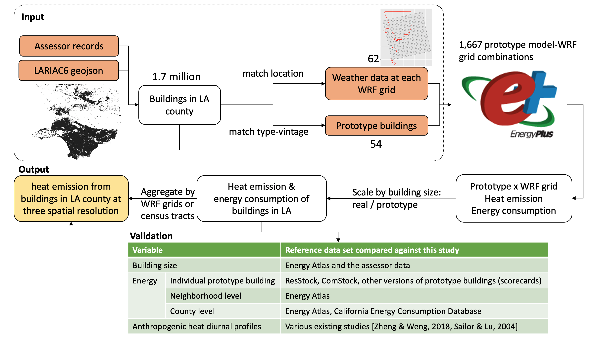

_your zenodo badge here_

# xu_etal_2022_tbd

**LA County Building Anthropogenic Heat During Heat Waves**

Yujie Xu1, Pouya Vahmani1, Tianzhen Hong\*, Andy Jones1

1  LBNL

\* corresponding author:  thong@lbl.gov

## Abstract
TBD

## Journal reference
TBD

## Code reference
<!-- References for each minted software release for all code involved.   -->

<!-- These are generated by Zenodo automatically when conducting a release when Zenodo has been linked to your GitHub repository. The Zenodo references are built by setting the author order in order of contribution to the code using the author's GitHub user name.  This citation can, and likely should, be edited without altering the DOI. -->

<!-- If you have modified a codebase that is outside of a formal release, and the modifications are not planned on being merged back into a version, fork the parent repository and add a `.<shortname>` to the version number of the parent and construct your own name.  For example, `v1.2.5.hydro`. -->

<!-- Human, I.M. (2021, April 14). Project/repo:v0.1.0 (Version v0.1.0). Zenodo. http://doi.org/some-doi-number/zenodo.7777777 -->

to be added

## Data reference

### Input data
LA buildings
- LA building charateristics: Assessor_Parcels_Data_-_2019.csv, from Dropbox
- LA building geometry: LARIAC6_LA_County.geojson

Climate
- WRF climate data (in a 12 km x 12 km grid system): from Pouya

### Output data
grid level data heat emission data: fixme add

## Contributing modeling software
| Model | Version | Repository Link | DOI |
|-------|---------|-----------------|-----|
| EnergyPlus | 22.1 | https://github.com/NREL/EnergyPlus |  |

## Reproduce my experiment

The following is an overview of the workflow

Following the steps to reproduce the analysis

1. Compile a LA county geojson file with building footprint, type, vintage,
   number of stories, and footprint area using the geometry and assessor data
   files from the Dropbox folder "City Data/LA".
2. Acquire WRF climate data (in a 12 km x 12 km grid system)
3. Convert the WRF climate data of the historic forcing (2018 July) to epw. In
   this conversion, the UTC time in WRF needs to be converted to local time in
   epw. We can use one representative grid in LA to compute the solar irradiance
   data using the excel tool. This irradiance data will be used in epw files of
   all grids, assuming there are little solar irradiance variations within the
   LA county. This corresponds to the “2_wrf_to_csv_epw” code on Github.
4. Assign the nearest grid point to each building. The epw files for the
   assigned grid point will be used in the simulation of the target building.
5. For each building type-vintage combination in each grid cell, simulate the
   historic forcing. There are xx possible prototype buildings and 3 possible
   vintages, but we will only simulate the type-vintage combination appearing in
   each grid cell (see xx for the mapping from grid cells to type-vintage
   combination). Use "3_write_baseline_idf" from
   [im3 repo from Xuan](https://github.com/LBNL-ETA/im3-wrf/blob/main/3_write_baseline_idf.ipynb) to
   create EnergyPlus models.
7. Adjust prototype models
- Change the design condition
- Remove un-used dependencies from files
- Update model version
8. Use run_sim.py to run simulations
9. Validation with measured and other data source: fixme: add rmd
10. Produce grid-level heat emission data.

<!-- Run the following scripts in the `workflow` directory to re-create this experiment: -->

<!-- | Script Name | Description | How to Run | -->
<!-- | --- | --- | --- | -->
<!-- | `step_one.py` | Script to run the first part of my experiment | `python3 step_one.py -f /path/to/inputdata/file_one.csv` | -->
<!-- | `step_two.py` | Script to run the last part of my experiment | `python3 step_two.py -o /path/to/my/outputdir` | -->

<!-- 4. Download and unzip the output data from my experiment [Output data](#output-data) -->
<!-- 5. Run the following scripts in the `workflow` directory to compare my outputs to those from the publication -->

<!-- | Script Name | Description | How to Run | -->
<!-- | --- | --- | --- | -->
<!-- | `compare.py` | Script to compare my outputs to the original | `python3 compare.py --orig /path/to/original/data.csv --new /path/to/new/data.csv` | -->

## Reproduce my figures
Fixme: add rmd files
<!-- Use the scripts found in the `figures` directory to reproduce the figures used in this publication. -->

<!-- | Script Name | Description | How to Run | -->
<!-- | --- | --- | --- | -->
<!-- | `generate_figures.py` | Script to generate my figures | `python3 generate_figures.py -i /path/to/inputs -o /path/to/outuptdir` | -->
